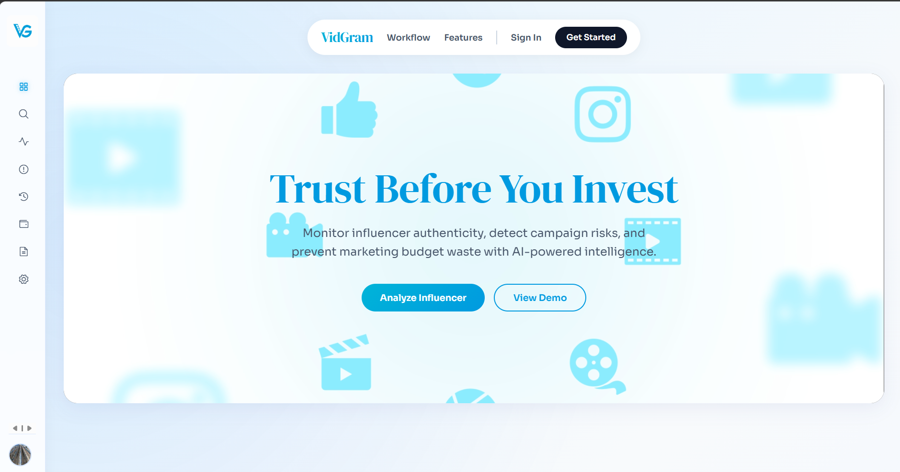
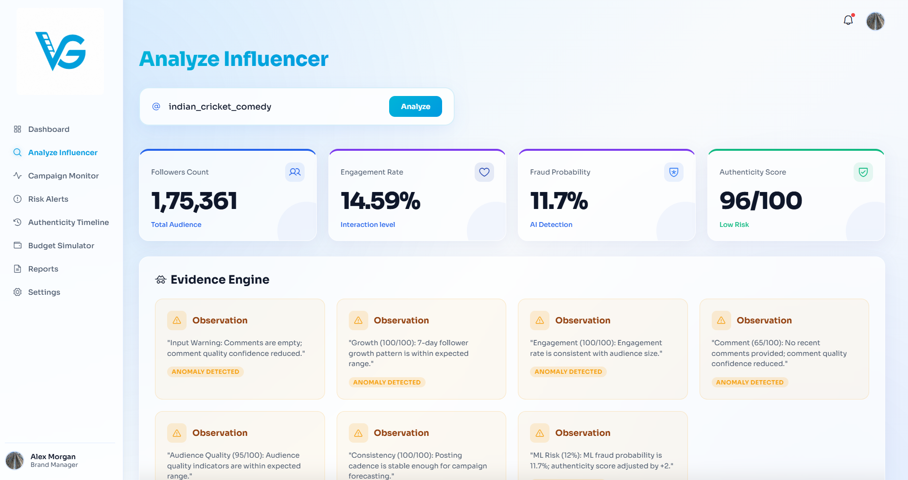
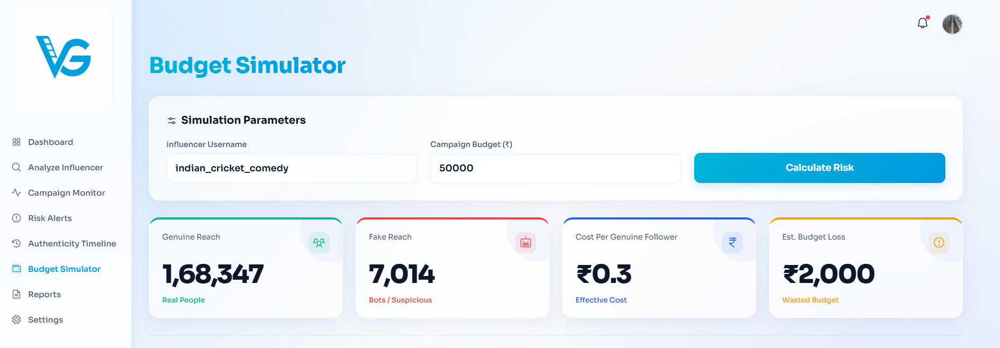
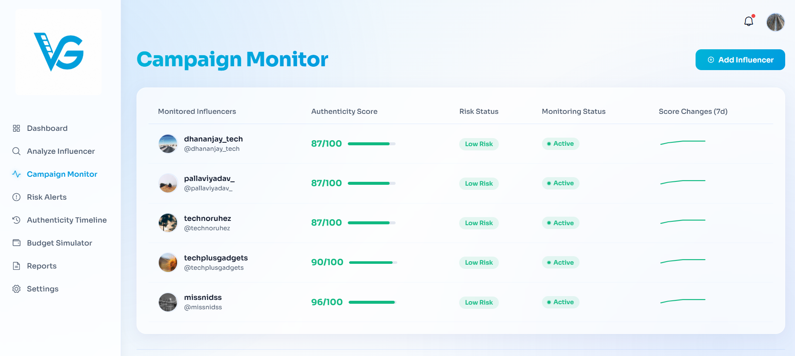
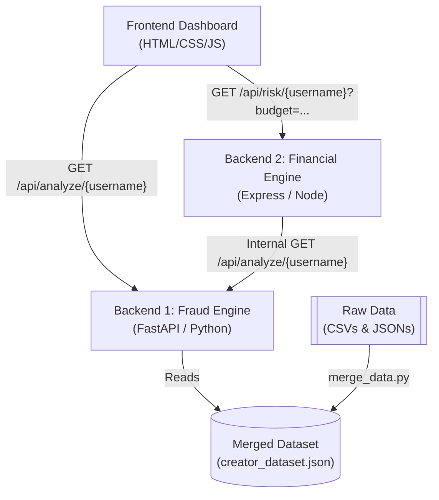

<div align="center">

# VidGram 📹

### Campaign Risk Intelligence & Fraud Detection Platform

*A professional, production-grade campaign risk analysis system that helps influencer marketing managers evaluate creator authenticity, detect bot activity, project financial losses, and monitor campaign risks over time.*

[](https://fastapi.tiangolo.com)
[](https://expressjs.com)
[](https://typescriptlang.org)
[](#)
[](./LICENSE)

[🚀 Getting Started](#getting-started) · [🏗️ Architecture](#architecture) · [✨ Features](#features) · [📸 Screenshots](#screenshots)

</div>

---

## 🧠 What is VidGram?

VidGram is a comprehensive end-to-end platform built to answer one critical question in modern influencer marketing:

> **How do you verify if a content creator has a genuine following, and how do you protect your marketing budget from fraudulent engagement?**

VidGram answers this by combining a machine learning-powered **Fraud Detection Engine** with a financial **Campaign Risk Engine**. It analyzes creator metrics—such as inactive followers, bot activity, spam comment patterns, and abnormal growth history—to compute an overall authenticity score. 

It then feeds this analysis into a financial calculator to project critical risk metrics: genuine reach, fake reach, and estimated budget loss, categorizing creators as *Shortlist*, *Monitor*, *Pause*, or *Reject*. 

---

<a name="screenshots"></a>

## 📸 Screenshots

### 🌐 Dashboard
> *A sleek dashboard presenting core marketing intelligence. Featuring dynamic metrics cards, recent influencer search logs, and quick action shortcuts for marketing campaign managers.*



---

### 🚀 Influencer Analysis — Fraud Scoring
> *Deep-dive analysis interface displaying authenticity scores, ML-driven fraud probabilities, and highlighted risk alerts. Interactive charts breakdown suspicious follower ratios, bot engagement, and audience demographics mismatch.*



---

### 💸 Budget Simulator — Financial Projections
> *An interactive budget forecaster where managers specify campaign budgets and project genuine vs. wasted spend. Real-time dials compute estimated cost per genuine follower and overall financial risk classification.*



---

### 📊 Campaign Monitor — Real-Time Surveillance
> *A live surveillance dashboard showing a tabular view of all monitored influencers, fetching live scores and risk alerts from the AI engines. Built-in sorting, filtering, and rapid search speed up creator sorting.*



---

<a name="features"></a>

## ✨ Features

| Feature | Description |
|---|---|
| **Multi-Engine Analysis** | Combines ML-driven fraud probability with rule-based heuristics for optimal risk classification |
| **Authenticity Scoring** | Computes a real-time credibility score (0-100) based on follower, comment, and growth history |
| **Budget Loss Simulator** | Projects financial waste by estimating how much budget is directed at fake or inactive accounts |
| **Real-Time Campaign Monitor** | Tracks multiple creators simultaneously with live status feeds and auto-updating metrics |
| **Bot Detection Algorithms** | Identifies automated bots by scanning comment repetition, timing anomalies, and suspicious username patterns |
| **Audience Quality Audits** | Details exact percentages of inactive profiles, bot accounts, and geographic audience mismatches |
| **Dynamic Search & Filters** | Instant dashboard searches by username and filters by risk levels (Shortlist, Monitor, Pause, Reject) |
| **Reports & Export** | Access historical risk metrics and campaign data for internal marketing presentations |
| **Evidence & Alert Logs** | Provides transparent explanations for flagged warnings with direct data evidence |
| **Micro-interaction UI** | Premium glassmorphism designs with responsive controls, charts, and smooth animations |

---

<a name="architecture"></a>
## 🏗️ Architecture

### How the Platform Works

```
Raw Social Data (CSVs & JSONs)
      ↓
data_processing/merge_data.py
      ↓
Unified creator_dataset.json
      ↓
Backend 1: Fraud Engine (FastAPI)  ← Reads Dataset, Runs ML & Heuristics
      ↓
Backend 2: Financial Engine (Express)  ← Fetches Fraud Data, Calculates Loss
      ↓
Frontend Dashboard (HTML/CSS/JS)  ← Visualizes Audits, Simulations, & Monitor Queue
```

### Complete System Data Flow



---

## 🛠️ Tech Stack

| Layer | Technology |
|---|---|
| **Frontend** | HTML5, Vanilla JavaScript, CSS3, Chart.js, Lucide Icons |
| **Backend 1 (Fraud)** | Python, FastAPI, Uvicorn, Pandas, scikit-learn |
| **Backend 2 (Financial)** | Node.js, Express.js, TypeScript, Axios, CORS |
| **Data Engine** | JSON database, custom python processing pipeline |
| **UI Styling** | Modern dark-theme CSS, CSS Grid, Flexbox, glassmorphic elements |

---

## 📂 Directory Structure

```
vidgram/
├── backend1/                  # Backend 1: Fraud Detection Engine
│   ├── detectors/             # Heuristic rules & growth detectors
│   ├── engines/               # ML, Alert, and Scoring engines
│   ├── app.py                 # FastAPI server entry point
│   └── api.py                 # API router and payload handling
│
├── backend2/                  # Backend 2: Financial Risk Engine
│   └── risk-engine/
│       ├── src/
│       │   ├── services/      # Risk calculation services
│       │   ├── utils/         # Math formulas (Reach, Loss, CPE)
│       │   └── server.ts      # Express server entry point
│       └── tsconfig.json      # TS compiler configuration
│
├── frontend/                  # Static Web Interface
│   ├── index.html             # Dashboard homepage
│   ├── analyze.html           # Influencer detail view
│   ├── budget.html            # Campaign budget simulator
│   └── monitor.html           # Campaign monitor dashboard
│
├── data/                      # Data files
│   └── merged/                # Unified creator_dataset.json
│
└── README.md                  # System Documentation
```

---

<a name="getting-started"></a>

## 🚀 Getting Started

### Prerequisites

- Node.js `18+`
- Python `3.9+`

### Setup

```bash
# 1. Clone the repository
git clone https://github.com/mayurigade-hub/vidgram.git
cd vidgram

# 2. Build the centralized dataset
python data_processing/merge_data.py

# 3. Configure and Start Backend 1 (Python)
cd backend1
pip install -r requirements.txt
python app.py
```
*FastAPI server will be running on `http://localhost:8000`*

```bash
# 4. Configure and Start Backend 2 (Node / Express)
cd ../backend2/risk-engine
npm install
npx ts-node src/server.ts
```
*Express server will be running on `http://localhost:3000`*

```bash
# 5. Serve the Frontend Dashboard (new terminal at project root)
python -m http.server 8080
```
*Dashboard will be served on `http://localhost:8080/frontend/index.html`*

---

## 📄 License

This project is licensed under the **MIT License** — see the [LICENSE](./LICENSE) file for details.

---

<div align="center">

*Built with Python, Node.js, TypeScript, and FastAPI.*

**VidGram — Campaign Risk Intelligence & Fraud Detection Platform**

</div>
