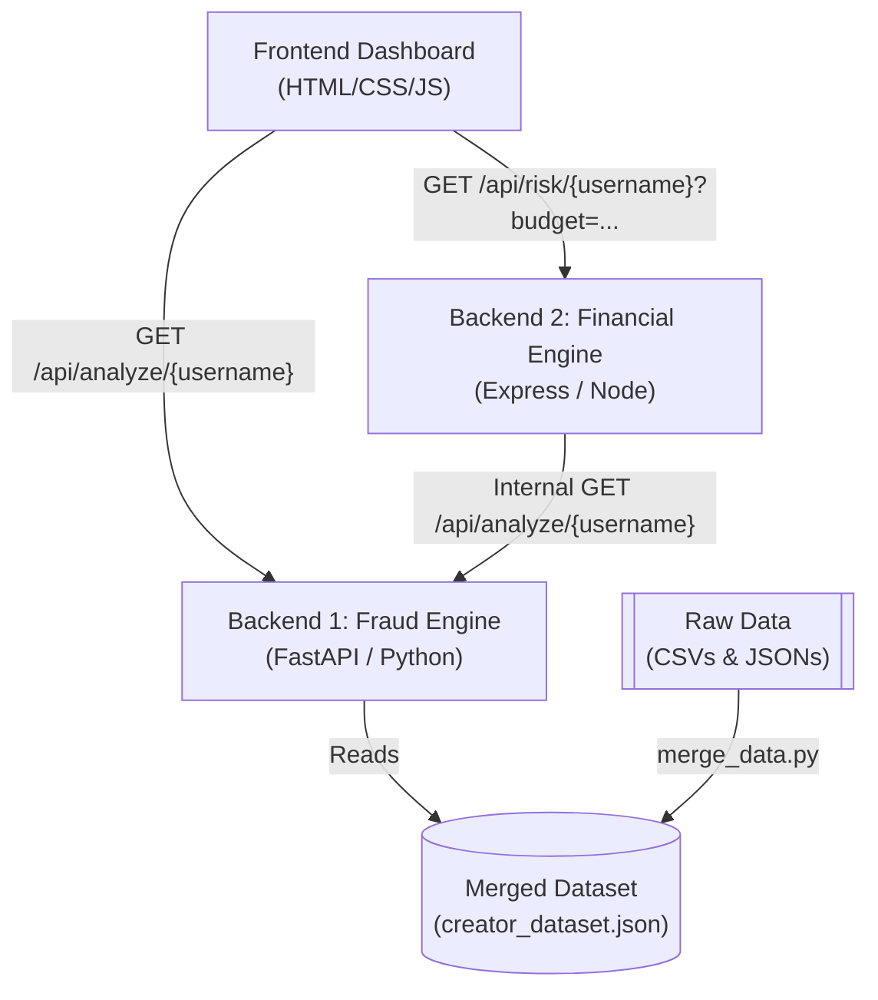

# VidGram Campaign Risk Intelligence Platform

VidGram is a comprehensive end-to-end platform for influencer marketing managers to analyze influencers, understand fraud risk, estimate campaign budget loss, compare influencers, and monitor campaign risks over time.

## Project Architecture



The project consists of three fully integrated modules working together:

1. **Frontend Dashboard**
   A sleek, dynamic user interface built with HTML, CSS, and Vanilla JavaScript. It provides dashboards for analyzing influencers, simulating budgets, and monitoring campaigns.

2. **Backend 1 - Fraud Detection Engine (Python / FastAPI)**
   A Python service that processes raw data (profiles, posts, comments, growth metrics) from a unified `creator_dataset.json` file. It evaluates influencer authenticity, detects bot engagement, and identifies suspicious growth patterns. 
   - **Endpoint**: `/api/analyze/{username}`

3. **Backend 2 - Financial Risk Engine (Node.js / Express / TypeScript)**
   A financial risk assessment layer that consumes data from Backend 1. It calculates business metrics such as genuine reach, fake reach, and estimated budget loss.
   - **Endpoint**: `/api/risk/:username?budget=50000`

---

## 🚀 Getting Started

### Prerequisites
- Node.js & npm
- Python 3.9+

### 1. Data Processing
The platform requires a centralized JSON dataset.
```bash
# From the project root
python data_processing/merge_data.py
```
*This generates `data/merged/creator_dataset.json`.*

### 2. Start Backend 1 (Fraud Detection)
```bash
cd backend1
pip install -r requirements.txt
python app.py
```
*Runs on `http://localhost:8000`*

### 3. Start Backend 2 (Financial Risk Engine)
```bash
cd backend2/risk-engine
npm install
npx ts-node src/server.ts
```
*Runs on `http://localhost:3000`*

### 4. Start the Frontend
In a new terminal window at the project root:
```bash
python -m http.server 8080
```
Open your browser and navigate to:
👉 **[http://localhost:8080/frontend/index.html](http://localhost:8080/frontend/index.html)**

*(Note: Depending on where you start the python server, you might need to use `http://localhost:8080/index.html` if you started it directly inside the `frontend` folder.)*

---

## Features
- **Analyze Influencer**: Search for influencers (e.g., `dhananjay_tech`, `missnidss`) to see their authenticity scores and ML fraud probabilities in real-time.
- **Budget Simulator**: Enter an influencer and a campaign budget to project how much of your budget would be lost to fake followers.
- **Campaign Monitor**: View a live, automatically refreshing table of your monitored influencers, pulling real-time risk scores from the AI engines.
